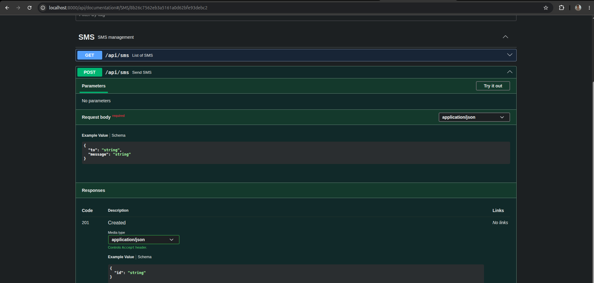
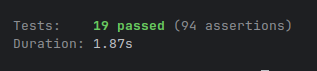
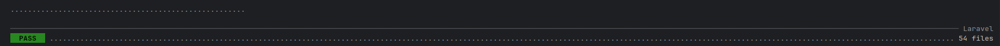
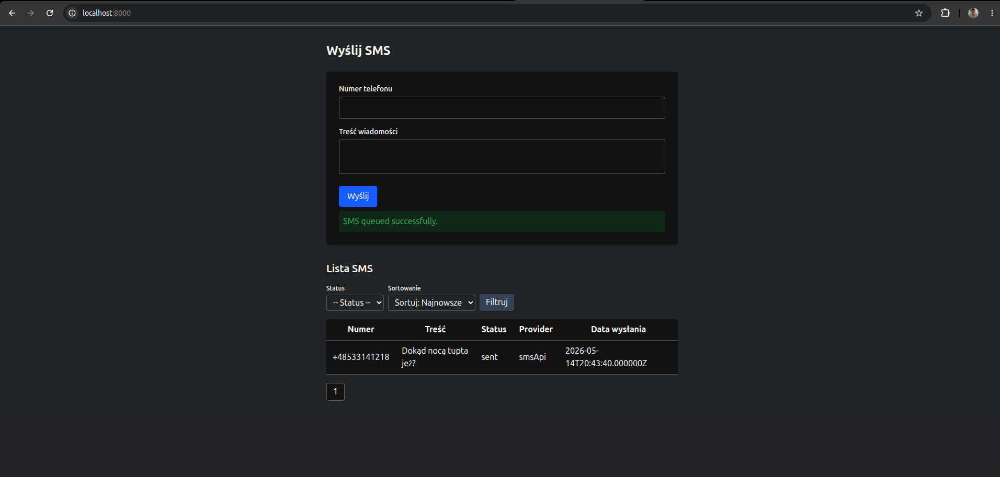
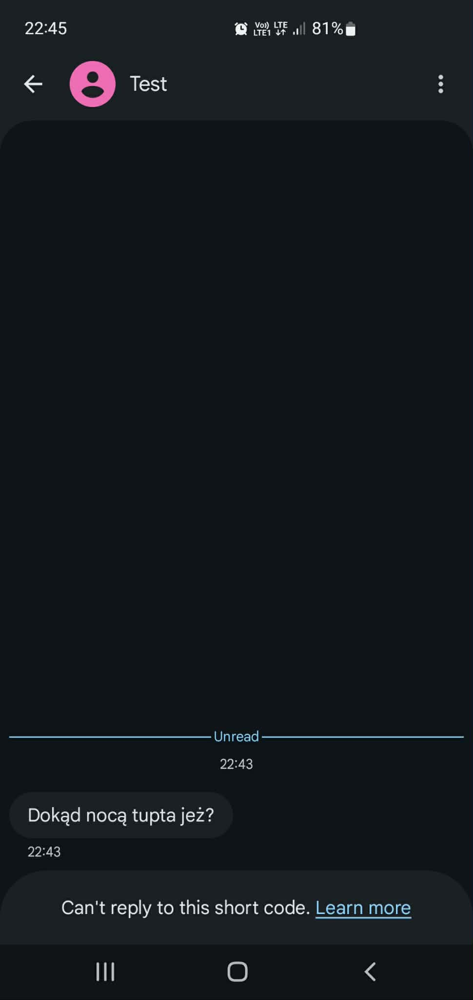

# SMS Gateway

## Instalacja

1. Skopiuj plik konfiguracyjny:
   ```bash
   cp .env.example .env
   ```
2. Ustaw token SMSAPI w pliku `.env`:
   ```env
   SMSAPI_TOKEN=twoj_token
   ```
3. Zainstaluj zależności backendu:
   ```bash
   composer install
   ```
4. Zainstaluj zależności frontendu:
   ```bash
   npm install
   ```
5. Zbuduj kontenery:
   ```bash
   docker compose build --no-cache
   ```
6. Wygeneruj klucz aplikacji:
   ```bash
   php artisan key:generate
   ```

## Uruchamianie

1. Uruchom Dockera:
   ```bash
   docker compose up -d
   ```
2. Uruchom frontend:
   ```bash
   npm run dev
   ```
3. Wejdź do kontenera aplikacji:
   ```bash
   docker exec -it sms-gateway-app bash
   ```
4. Uruchom serwer aplikacji:
   ```bash
   php artisan serve --host=0.0.0.0 --port=8000
   ```
5. Uruchom worker kolejki:
   ```bash
   php artisan queue:work
   ```

## Migracje

1. Wejdź do kontenera aplikacji:
   ```bash
   docker exec -it sms-gateway-app bash
   ```
2. Wykonaj migracje:
   ```bash
   php artisan migrate
   ```

## Dokumentacja Swagger



1. Wygeneruj dokumentację:
   ```bash
   php artisan l5-swagger:generate
   ```

## Testy



1. Wejdź do kontenera aplikacji:
   ```bash
   docker exec -it sms-gateway-app bash
   ```
2. Uruchom testy:
   ```bash
   ./vendor/bin/phpunit
   ```

## Pint



1. Wejdź do kontenera aplikacji:
   ```bash
   docker exec -it sms-gateway-app bash
   ```
2. Uruchom Pint:
   ```bash
   ./vendor/bin/pint
   ```

## UI



## Otrzymany SMS



## Adresy aplikacji

- Frontend: [http://localhost:8000/](http://localhost:8000/)
- API: [http://localhost:8000/api/](http://localhost:8000/api/)
- Swagger: [http://localhost:8000/api/docs](http://localhost:8000/api/docs)

## Stack technologiczny

- Laravel 13
- Vite 8
- Docker
- PostgreSQL 18
- PHP 8.5
- PHPUnit 11
- Pint 1.29

## Opis aplikacji

- 2 endpointy w PHP
- 2 widoki w Blade
- Baza danych PostgreSQL
- Kolejka do obsługi wysyłania SMS-ów
- Testy w PHPUnit
- Formatowanie kodu przez Pint
- Szybka podmiana providera SMS (implementacja `SmsProviderInterface`, rejestracja w `SmsMessageProvider` i `AppServiceProvider`)
- Wysyłka: walidacja, tworzenie rekordu, dodanie do kolejki, asynchroniczna wysyłka, aktualizacja rekordu po wysyłce
- Lista: paginacja, sortowanie, filtrowanie
